SillyTavern is a user interface you can install on your computer (and Android phones) that allows you to interact with text generation AIs and chat/roleplay with the characters you or the community create.

!!!info
SillyTavern is just a UI; you will need to connect it to a backend: [KoboldAI](https://docs.pygmalion.chat/local-installation-(gpu)/kobold/) or [TextGen WebUI](https://docs.pygmalion.chat/local-installation-(gpu)/oobabooga/).
!!!

<!--  -->
|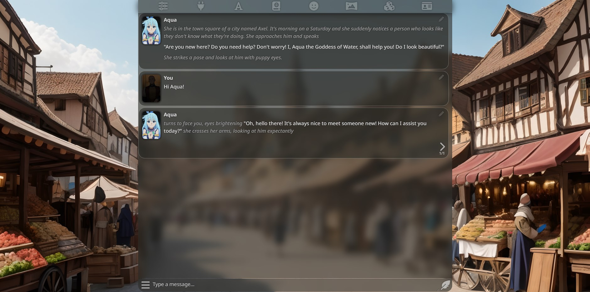 | 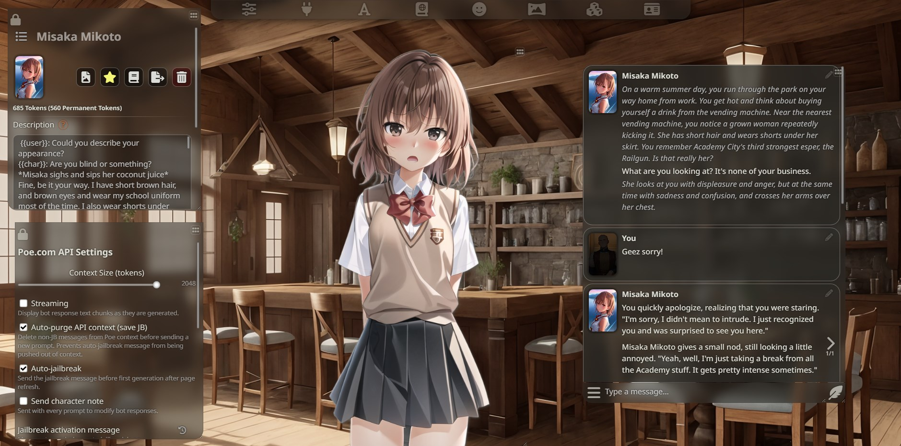 |
|:---:|:---:|
|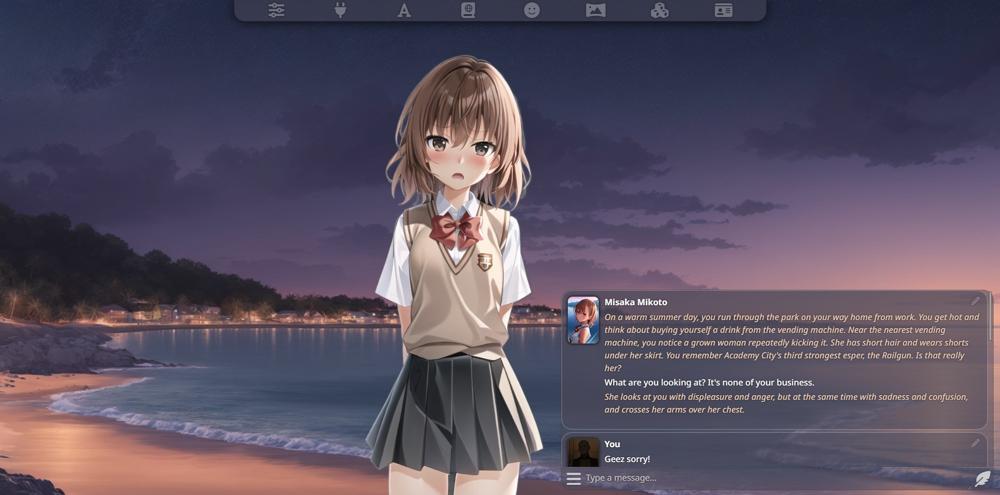 | 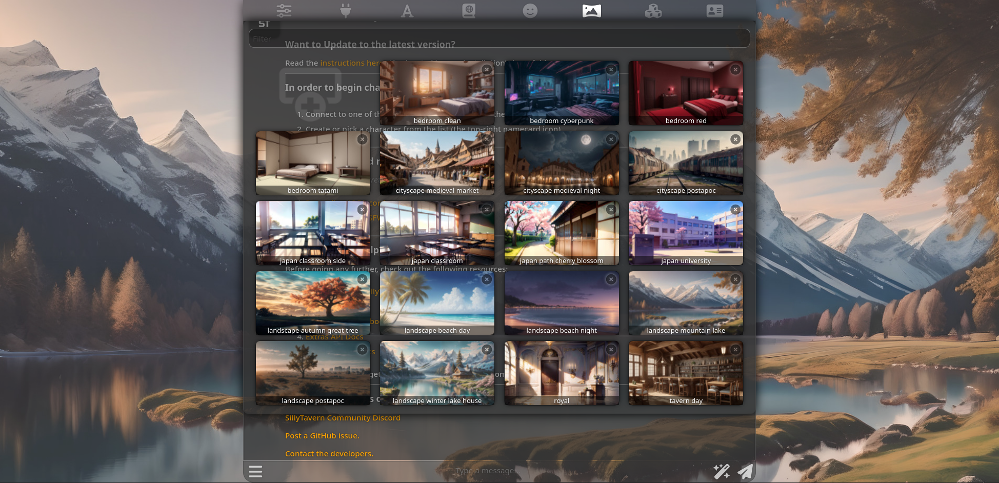 |


## Navigation

#### API Menu
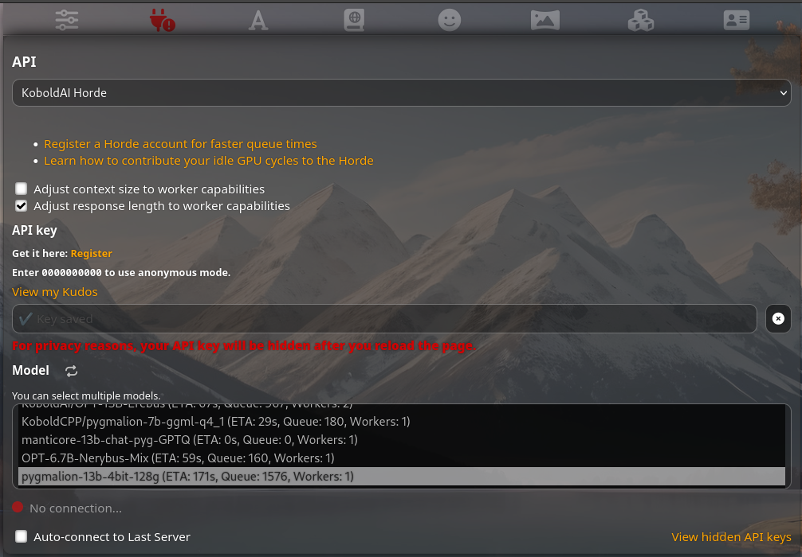

This is where you select the API you wish to connect SillyTavern to. The currently supported APIs are: [KoboldAI](https://docs.pygmalion.chat/local-installation-(gpu)/kobold/), [Kobold Horde](https://docs.pygmalion.chat/cloud-installation/horde/), Oobabooga's [TextGen WebUI](https://docs.pygmalion.chat/local-installation-(gpu)/oobabooga/), [NovelAI](https://novelai.net), [OpenAI](https://platform.openai.com), and [Poe](https://poe.com). **Pygmalion is only accessible through KoboldAI, Kobold Horde, and Oobabooga.** Instructions for acquring the API Key for those two are provided in their respective pages - SillyTavern itself offers guides for acquiring your API key for the other three.

#### Advanced Formatting
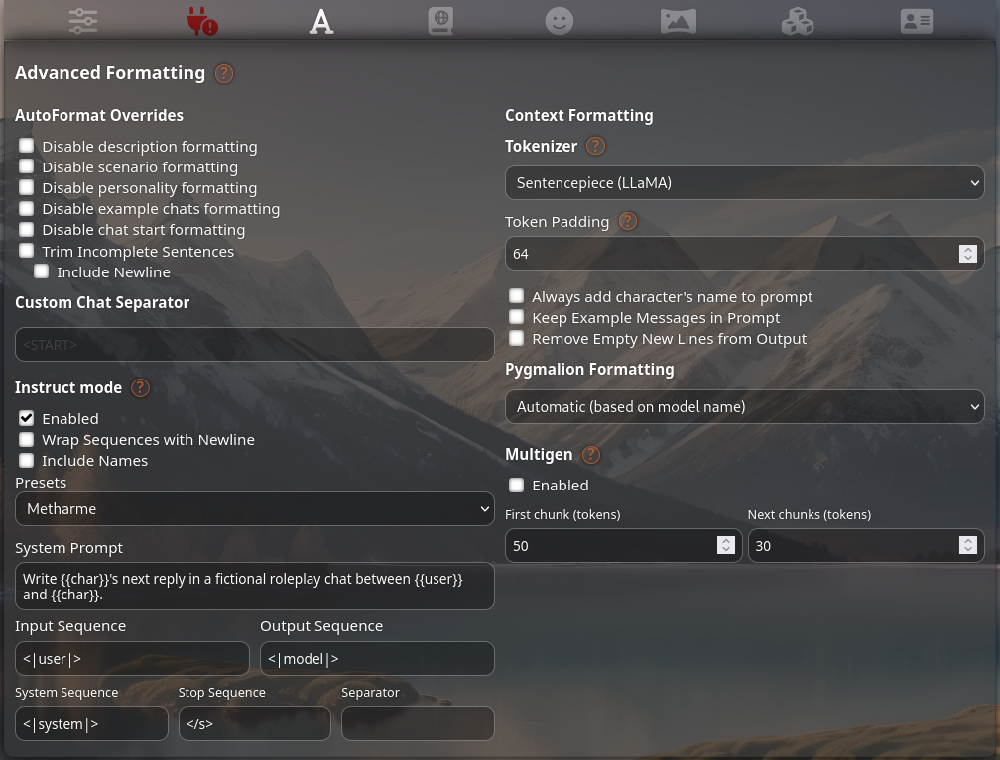

This is where you'll find various options for a more intimate control over the model's prompting and output. You can click on the question mark next to the "Advanced Formatting" title in SillyTavern for an in-depth explanation of each option. For Pygmalion, this can be left mostly alone - just make sure the Tokenizer is set to "Sentencepiece (LLaMA)" for Pygmalion 7B/13B. For Metharme models, select "Metharme" from the Presets drop-down menu and you're good to go.

#### World Selector
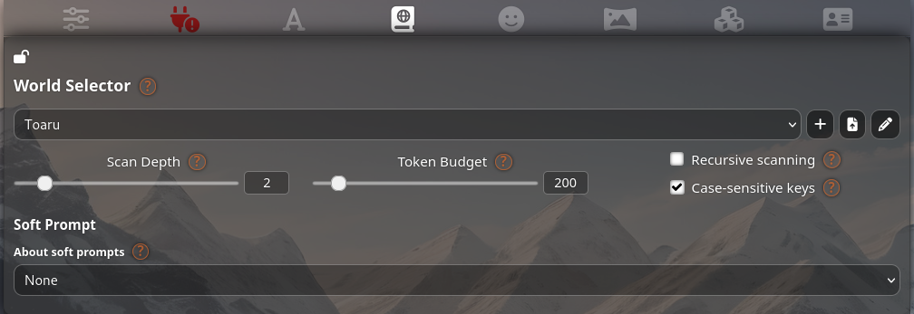

You can load your World Info and Soft Prompt file here. For a more in-depth explanation, refer to our [Soft Prompt](https://docs.pygmalion.chat/pygmalion-extras/soft-prompt/) and [World Info](https://docs.pygmalion.chat/settingsandparams/#wi-depth-world-info) pages. You can also click on the Question Mark next to each option in ST for a detailed overview.

#### User Settings
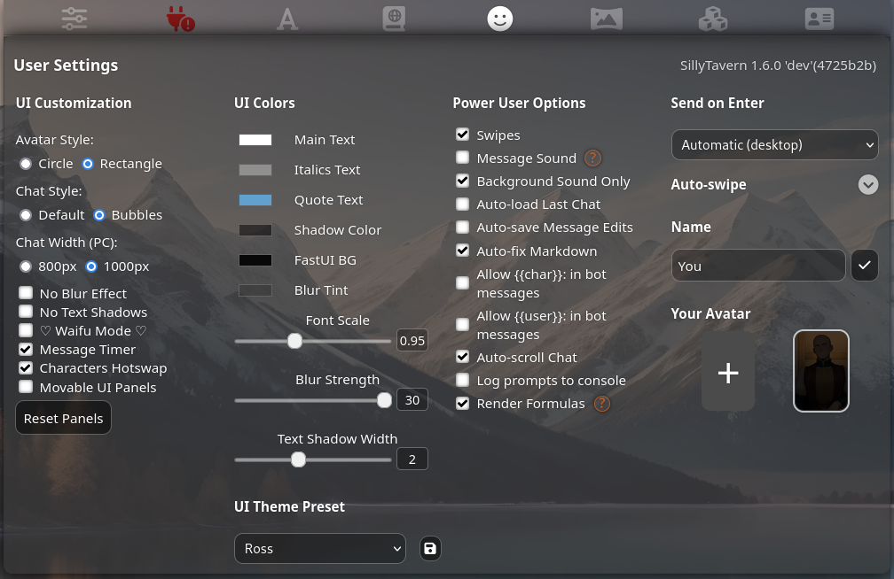

You can customize the UI and basic SillyTavern behaviour here. Notable options are Waifu Mode, UI Theme Preset, Swipes, User Name, and UI Colors. The names are mostly self-explanatory - Waifu Mode crops the Chat Box so you can see your character's sprite (if you've added one).

#### Background Images
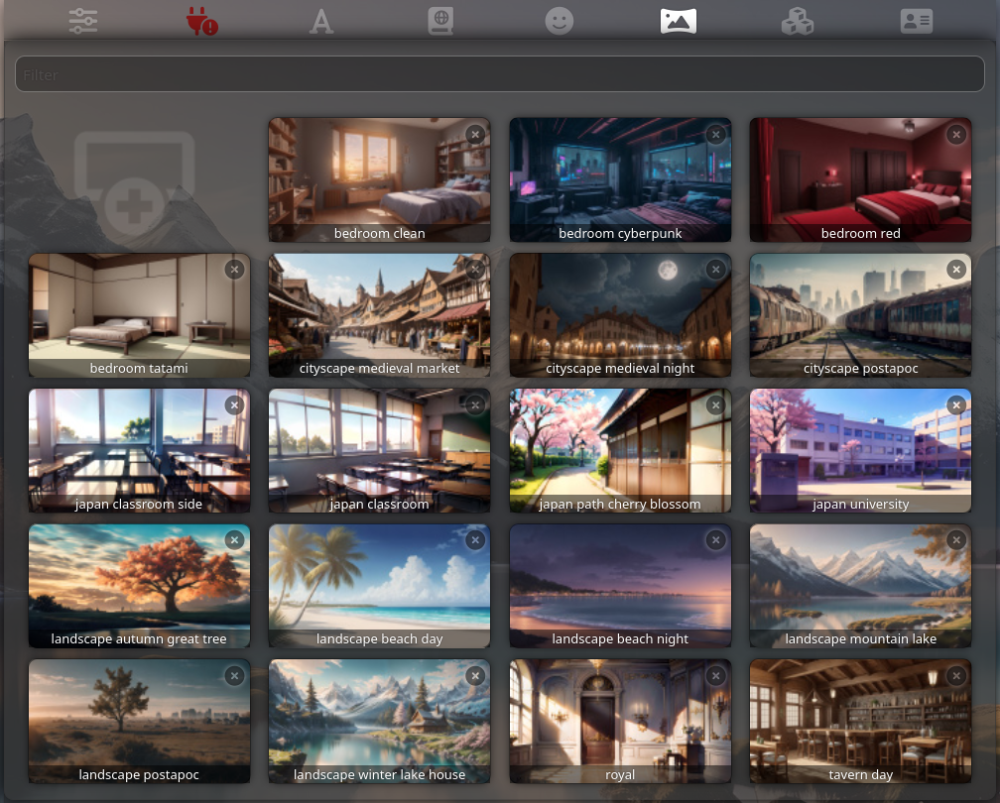

You can select or add new background images here. Make sure to pick one that fits the chat's mood!

#### Extensions API
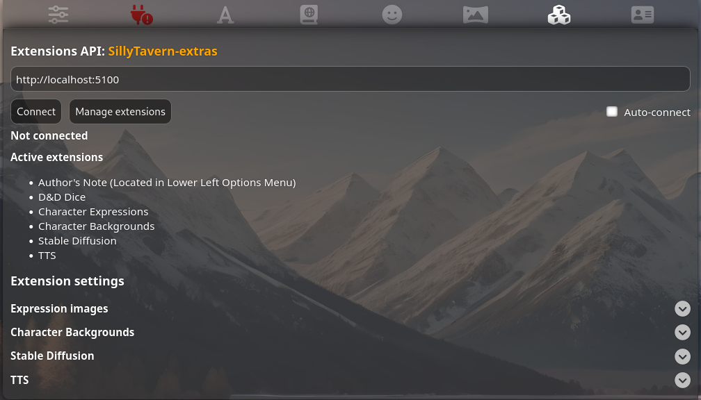

This menu is for SillyTavern Extras and various other extensions. You can add Expression images for your characters, use Stable Diffusion to generate images of the chat/story, TTS for making your characters talk, and image captioning so you can send images directly to your character! 

You can either run SillyTavern-extras [locally](https://github.com/Cohee1207/SillyTavern-extras) or use the provided [Google Colab Notebook](https://colab.research.google.com/github/Cohee1207/SillyTavern/blob/main/colab/GPU.ipynb). If you went the local route, launch ST-Extras and click connect in ST. If you use Colab, copy your Remote URL and paste it in the API field, then click connect.

Stable Diffusion generations are done through either SillyTavern-extras or Stable Horde. If you're not using the extras, make sure you check the "Use Stable Horde" option. If you have kudos, make sure you add your Horde API Key in the API menu first.

#### Character Management
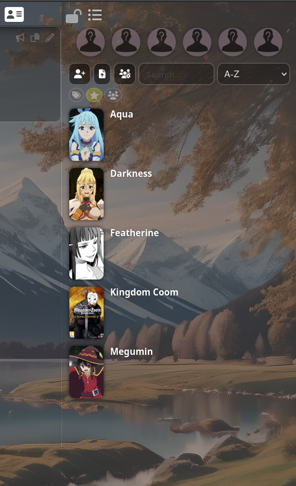
You can create, upload, and manage your characters here. ST by default comes with 3 characters - Aqua, Darkness, and Megumin. You can also assign tags for each character based on their character style (docs on those are currently a WIP). You can also create Group Chats here (similar to Rooms in C.AI).

#### Presets
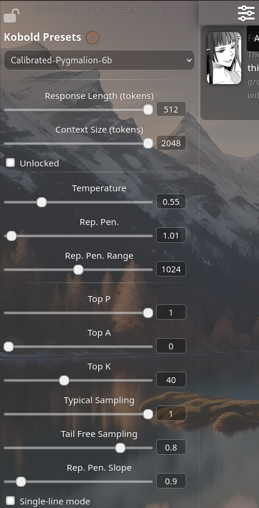

Depending on which API you've selected, you can choose from the multiple presets provided by the ST team. You can also adjust the generation settings here (learn more about those [here](https://docs.pygmalion.chat/settingsandparams/)). Keep in mind that all current Pygmalion/Metharme models have a hard-coded context limit of 2048 tokens, so please don't unlock the context size to assign a higher value.

## Installation
Installing SillyTavern is simple. It supports the following operating systems:
- [Windows x64](https://docs.pygmalion.chat/pygmalion-extras/sillytavern/#windows-installation)
- [Linux x64](https://docs.pygmalion.chat/pygmalion-extras/sillytavern/#linuxmacos-installation)
- [macOS (Darwin x64)](https://docs.pygmalion.chat/pygmalion-extras/sillytavern/#linuxmacos-installation)
- [Android (aarch64)](https://docs.pygmalion.chat/pygmalion-extras/sillytavern/#android-installation)


### Windows Installation

First, you will need to install [Node.js](https://nodejs.org/en/download/current){target="blank"}.


Just open the installer, and click on Next, Next, etc... Leave everything as default.
Once Node.JS is installed, you can download Silly Tavern!

!!!info
You'll need [Github Desktop](https://central.github.com/deployments/desktop/desktop/latest/win32) to clone the repository.
!!!

After installing GitHub Desktop, click on `Clone a repository from the internet...`. (Note that you do not need to create an account for this step)


On the menu, go into the `URL` tab, enter this url `https://github.com/Cohee1207/SillyTavern` and click `clone`.

!!!info
You can change the `Local path` to change where SillyTavern is going to be downloaded.
!!!


To open SillyTavern, just go into the folder where you cloned the repository, and double click on the start.bat file. 
!!!info
By default, the repository will be clone here : `C:\Users[Your Account Name]\Documents\GitHub\SillyTavern`
!!!


<!-- Open PowerShell (you can search for it in the start menu) and type in `winget install -e --id OpenJS.NodeJS`. Once it's finished, close PowerShell.

You can confirm whether NodeJS is installed by running `node -v` in PowerShell.

To run SillyTavern, all you'll need to do is open PowerShell again and running `npx sillytavern@latest`. This will open SillyTavern in your browser. You can re-launch SillyTavern anytime by running `npx sillytavern@latest`. -->

If everything is working, the CMD should look like this and a SillyTavern tab should be open in your browser.


!!!warning
You still have to [connect](https://docs.pygmalion.chat/pygmalion-extras/sillytavern/#connect-sillytavern) it to a backend API!
!!!


### Linux/MacOS Installation

#### Requirements
- nodejs
- git

Install `nvm` (NodeJS Version Manager) by running the following command in Terminal:

```bash
curl -o- https://raw.githubusercontent.com/nvm-sh/nvm/v0.39.3/install.sh | bash
```

Run this to make `nvm` usable:

```bash
export NVM_DIR="$([ -z "${XDG_CONFIG_HOME-}" ] && printf %s "${HOME}/.nvm" || printf %s "${XDG_CONFIG_HOME}/nvm")"
[ -s "$NVM_DIR/nvm.sh" ] && \. "$NVM_DIR/nvm.sh"
```

Install NodeJS by running the following command:

```bash
nvm install node
```

#### Installation (with `npx`)

Run `npx sillytavern@latest`. You can re-open it anytime by running the command again. Omit the `@latest` part of the command to not auto-pull the latest update as that might overwrite all your previous characters and chatlogs. 


#### Installation (manual)

- Clone the repo
```
git clone -b dev https://github.com/Cohee1207/SillyTavern && cd SillyTavern
```

- Run TavernAI
```
npm i && node server.js
```

### Android Installation

- Install [Termux](https://f-droid.org/repo/com.termux_118.apk).
- Run the following commands inside Termux, in order:

Update repos/packages:
```bash
pkg update && pkg upgrade
```

Install NodeJS and git:
```bash
pkg install nodejs openssl
```
```bash
pkg install git
```

Download Silly Tavern:
```bash
git clone -b dev https://github.com/Cohee1207/SillyTavern && cd SillyTavern
```
!!!warning fatal: destination path 'SillyTavern' already exists
If you receive the above error, it means you've already downloaded SillyTavern before. In that case, you can simply update it. Change directories to SillyTavern by running `cd SillyTavern`, and then updating it by running `git pull`. 
!!!

<!-- Run SillyTavern:
```bash
npx sillytavern@latest
```
 -->
 Run SillyTavern:
```bash
npm i && node server.js
```

!!!info
You can run SillyTavern again by simply opening Termux and entering the command above!
!!!

#### Connect to Horde


## Connect SillyTavern


!!!info The API URL
If you're running KoboldAI locally, all you need to paste in there is `http://localhost:5000/api`. If you're using Google Colab, copy your [remote URL](https://docs.pygmalion.chat/cloud-installation/koboldai/#using-the-remote-url-to-connect-sillytavern) instead. If it ends with a `#` or `new_ui`, remove them and replace them with `/api`. If they don't, simply adding `/api` will suffice.
!!!


!!!success You're done!
You can now start using SillyTavern! SillyTavern uses Character Cards, which are images (PNG and WEBP) that can be imported to Tavern as Characters. You can also find new characters in the unofficial [Discord server](https://discord.com/invite/pygmalionai).


